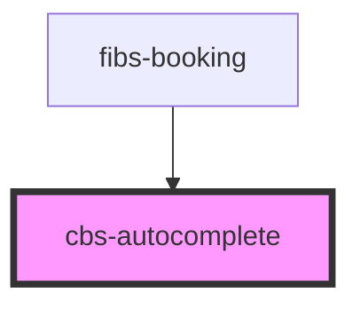

# cbs-autocomplete

<!-- Auto Generated Below -->

## Properties

| Property             | Attribute | Description | Type     | Default     |
| -------------------- | --------- | ----------- | -------- | ----------- |
| `target`             | `target`  |             | `string` | `undefined` |
| `value` _(required)_ | `value`   |             | `string` | `undefined` |

## Methods

### `fetchAdress(val: any) => Promise<void>`

#### Returns

Type: `Promise<void>`

## Dependencies

### Used by

 - [fibs-booking](../fibs-booking)

### Graph

----------------------------------------------

*Built with [StencilJS](https://stenciljs.com/)*
