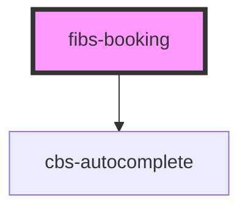

# fibs-booking

<!-- Auto Generated Below -->

## Properties

| Property              | Attribute | Description | Type     | Default     |
| --------------------- | --------- | ----------- | -------- | ----------- |
| `API`                 | `a-p-i`   |             | `any`    | `undefined` |
| `apikey` _(required)_ | `apikey`  |             | `string` | `undefined` |
| `cover`               | `cover`   |             | `string` | `undefined` |
| `height`              | `height`  |             | `string` | `'80vh'`    |

## Dependencies

### Depends on

- [cbs-autocomplete](../cbs-autocomplete)

### Graph

----------------------------------------------

*Built with [StencilJS](https://stenciljs.com/)*
